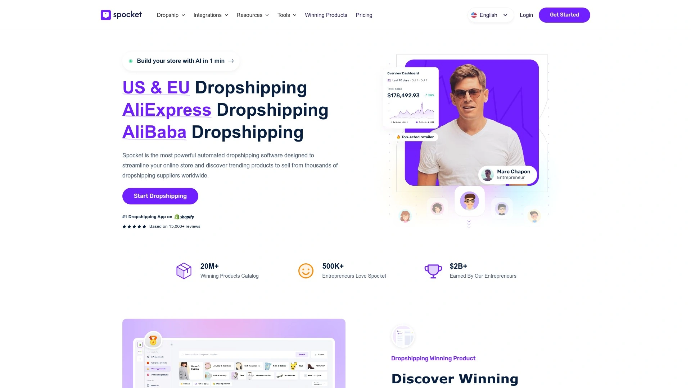

# Top 16 Dropshipping Automation Tools Ranked in 2025 (Latest Compilation)

Running an online store means juggling product imports, inventory tracking, supplier coordination, and order fulfillment—all while trying to actually make sales. The right automation tool transforms this chaos into a streamlined operation where products sync automatically, orders route to suppliers instantly, and your business scales without drowning you in manual work. Whether you're launching your first Shopify store or managing multiple sales channels, these platforms handle the heavy lifting so you can focus on growth and customer acquisition.

## **[AliDrop](https://www.alidrop.co)**

Your all-in-one solution for AliExpress, Alibaba, and Temu product sourcing with premium supplier access.

AliDrop streamlines dropshipping by connecting you to over 100 million products from AliExpress, Alibaba, and Temu, plus verified US and EU suppliers for faster delivery. The platform's one-click import system lets you add trending products directly to Shopify stores without manual data entry, while automated order fulfillment sends purchases straight to suppliers for processing. Real-time inventory syncing prevents overselling, and the integrated trending product finder helps identify high-demand items before markets saturate.

**For Shopify sellers specifically**, AliDrop offers native integration that automates product imports, price updates, and tracking number uploads—eliminating the tedious backend work that typically consumes hours each week. The supplier network includes both traditional Chinese manufacturers and domestic warehouses in Western countries, giving you flexibility between cost savings and shipping speed depending on your market positioning.

New dropshippers appreciate the straightforward interface that doesn't require technical expertise, while experienced sellers value the bulk import capabilities and multi-store management features. The platform particularly excels for stores targeting North American and European customers who expect reasonable delivery times, since you can selectively source from regional suppliers without managing multiple vendor relationships manually.

## **[DSers](https://www.dsers.com)**

Official AliExpress partner specializing in bulk order processing and multi-store automation.

DSers built its reputation on processing speed—you can place hundreds of orders simultaneously instead of fulfilling them one at a time. As AliExpress's official dropshipping partner, the platform offers cashback on purchases and priority support for resolving supplier issues. The system supports both Shopify and WooCommerce, automatically syncing inventory levels and product details across your stores while tracking price changes from suppliers.

The free basic plan covers essential automation, making DSers accessible for bootstrapped beginners, though paid tiers unlock features like advanced analytics and higher product limits. Multi-store management becomes practical when you're testing different niches or scaling horizontally, since you control everything from one dashboard rather than logging into separate accounts. Order tracking updates flow automatically to customers, reducing support inquiries about shipment status.

**Limitations surface if you source beyond AliExpress**—the platform doesn't integrate with other marketplaces, so sellers diversifying their supplier base need additional tools. For pure AliExpress dropshippers though, especially those processing high order volumes, DSers handles the operational load that would otherwise require hiring virtual assistants.

## **[AutoDS](https://www.autods.com)**

Full-spectrum automation platform supporting multiple marketplaces with AI-powered product research.

AutoDS goes beyond basic dropshipping by incorporating product research tools, price monitoring, and automated fulfillment across Shopify, eBay, Facebook Marketplace, and Wix. The AI product finder analyzes sales data and trends to surface potentially profitable items before they become oversaturated, giving you an edge in product selection. Stock and price monitoring runs continuously, automatically updating your listings when suppliers change details so you avoid selling out-of-stock items or listing outdated prices.

**Platform versatility** means you're not locked into one sales channel—manage Shopify, eBay, and social commerce from a unified interface. The system handles imports from AliExpress, Amazon, Walmart, and private suppliers, letting you curate products from wherever you find the best deals or unique inventory. Auto-ordering processes payments to suppliers when customers buy, and tracking information uploads automatically to your stores.

Entry-level plans start around $24 monthly with a $1 trial period, positioning AutoDS in the mid-range for automation tools. The learning curve exists—you're dealing with more features than simpler platforms—but that complexity translates to capabilities once you're comfortable with the dashboard. Sellers running multi-channel operations or seeking all-in-one consolidation find AutoDS worth the monthly investment.

## **[Spocket](https://www.spocket.co)**

US and European supplier network delivering faster shipping with branded invoicing capabilities.

Spocket differentiates itself through geography—suppliers are predominantly based in the United States and EU, cutting delivery times to 2-7 days instead of the 2-3 weeks typical with Asian suppliers. Faster shipping improves customer satisfaction and reduces refund requests from impatient buyers, making it particularly valuable for markets where Amazon has conditioned consumers to expect rapid delivery. Branded invoicing lets you include custom packing slips and remove supplier information, maintaining brand consistency when packages arrive.

The product catalog skews toward quality over quantity—you'll find fewer total items than massive marketplaces like AliExpress, but items tend toward higher perceived value and better manufacturing standards. Pricing reflects this positioning; wholesale costs run higher than Chinese manufacturers, meaning you need strong marketing to justify retail prices that maintain healthy margins.

**Integration spans Shopify and WooCommerce** with straightforward setup that doesn't require technical knowledge. The platform works well for branded stores targeting Western customers who value quick shipping and won't tolerate long fulfillment times, though budget-conscious dropshippers might struggle with the higher product costs eating into margins.

## **[CJDropshipping](https://cjdropshipping.com)**

Massive product catalog with global warehousing, custom sourcing, and print-on-demand services.

CJDropshipping offers millions of products across every conceivable category, plus the ability to request custom sourcing for items not already in their system. The platform operates over 50 warehouses worldwide, enabling local fulfillment that reduces shipping times without limiting you to regional inventories. Print-on-demand functionality lets you upload designs for apparel and accessories that CJ produces and ships on-demand, merging dropshipping with custom products.

**No monthly subscription fees**—you pay only product costs and shipping per order, making CJ financially accessible for sellers testing markets or operating on tight budgets. Platform integrations cover Shopify, WooCommerce, eBay, Amazon, and TikTok Shop, accommodating diverse selling strategies. Personal agents assist with product sourcing, quality checks, and operational questions, essentially providing human support beyond automated systems.

The sheer variety means time investment in product selection—unlike curated platforms, you're browsing enormous catalogs without pre-filtering for quality or viability. CJ suits sellers who want maximum flexibility and are comfortable evaluating suppliers independently, or those scaling to volumes where customization and direct factory relationships become valuable.

## **[Zendrop](https://zendrop.com)**

Curated supplier network with US fulfillment focus and educational resources for new sellers.

Zendrop maintains relationships with vetted suppliers rather than opening access to every manufacturer, prioritizing reliability over unlimited selection. Products sourced from Zendrop's network ship from US warehouses in 2-5 days, positioning your store competitively against Amazon on delivery speed. The free plan provides basic functionality while paid tiers at $49-79 monthly unlock auto-fulfillment, advanced branding, and priority support.

**Educational components** include Zendrop Academy and regular training content, making it beginner-friendly for people new to ecommerce. Custom branding options—private labels, custom packaging, branded inserts—help build recognizable brands rather than generic dropshipping stores. The platform pre-selects winning products based on market data, reducing research time for sellers less experienced with product validation.

Catalog size trades breadth for quality control—you won't find as many niche or obscure products as marketplaces with millions of listings, but items available typically ship reliably without quality surprises. Zendrop works best for sellers building branded stores targeting US customers who value consistent quality and fast delivery over rock-bottom prices.

## **[Dropified](https://dropified.com)**

Multi-platform automation with product bundling and high-end product focus.

Dropified automates order fulfillment across Shopify, BigCommerce, WooCommerce, CommerceHQ, and GrooveKart while sourcing from AliExpress, eBay, and Alibaba. Product bundling lets you create packages combining multiple items into single offers, increasing average order value without manually managing split fulfillments. The platform handles payment processing to suppliers automatically when customers order, and tracking information flows back to your store without manual updates.

**Full automation extends to customer notifications**—buyers receive shipping status updates including courier details and tracking links without you touching anything. Price optimization monitors supplier changes and adjusts your listings to maintain margins or notify you of needed updates. The product focus has shifted toward higher-ticket items with better margins compared to cheap impulse purchases.

No free tier exists—Dropified requires paid subscription, which filters out casual experimenters but ensures committed users access full features immediately. The cashback program on AliExpress orders returns a percentage of purchase volume as credits, helping offset operational costs for high-volume stores. Sellers managing multiple platforms or selling premium products benefit most from Dropified's comprehensive automation and bundling capabilities.

## **[Syncee](https://syncee.io)**

Brand-oriented supplier directory emphasizing Western manufacturers and wholesale relationships.

Syncee connects you with established brands and manufacturers from the US, UK, Canada, Australia, and Europe rather than anonymous Chinese suppliers. The 8+ million product database includes premium items with higher quality standards and better brand recognition, though wholesale costs reflect that positioning. Unlimited supplier automation means you can work with multiple vendors simultaneously without managing separate systems for each relationship.

**Alibaba sourcing integration** provides access to factory-direct pricing for products where volume justifies minimum orders, bridging dropshipping with traditional wholesale. The free tier lets you test the platform though with limited product imports, while paid plans unlock full catalog access. Real-time syncing prevents overselling by updating your inventory when supplier stock changes.

Integration compatibility spans major ecommerce platforms, ensuring your tech stack connects smoothly regardless of your store setup. Syncee targets sellers building legitimate brands in mid-to-premium market segments rather than competing on price alone, since quality products command higher prices that support the business model. You'll pay more per product but gain reliability and brand reputation that cheap alternatives can't provide.

## **[Printful](https://www.printful.com)**

Full-service print-on-demand with in-house fulfillment centers and built-in design tools.

Printful owns and operates printing facilities in the US, EU, and globally, ensuring consistent quality control compared to platforms coordinating third-party printers. The product range covers 370+ items including apparel, accessories, home decor, and more—all customizable with your designs. Built-in design tools let you create products directly on the platform without external software, streamlining the creative-to-listing workflow.

**Automated order routing** selects the nearest fulfillment center when customers order, minimizing shipping time and costs. Mockup generation creates realistic product images automatically, eliminating the need for physical samples or expensive photography when building listings. Integration with major ecommerce platforms and marketplaces means you connect once and orders flow automatically from sales to production.

Free to start with no monthly fees—you pay only product costs when orders come in, making it risk-free for testing designs. Print quality maintains high standards thanks to in-house production, though you'll pay slightly more per unit than some competitors using distributed printer networks. Printful suits creators prioritizing quality and consistency over absolute lowest costs, particularly those selling in established markets where customers expect premium execution.

## **[Printify](https://www.printify.com)**

Largest print-on-demand catalog with global printer network offering competitive pricing.

Printify connects to 1,300+ customizable products through a network of printing partners worldwide, giving you the broadest selection in print-on-demand. The distributed printer model means you choose facilities based on location, pricing, and capabilities rather than being locked to one production partner. Product Creator tools help design items with templates and customization options that don't require graphic design expertise.

**Pricing runs competitively** since multiple printers bid for your business, letting you optimize for cost, speed, or quality depending on priorities. Global fulfillment network reduces international shipping times by producing items closer to end customers. Nine platform integrations plus API access accommodate various tech stacks and selling strategies.

Free plan provides full access without monthly subscription, charging only per-order product costs when sales occur. Print quality varies by provider since you're working with different facilities—research and test samples ensure you select reliable printers for your products. Printify works well for sellers wanting maximum product variety and cost optimization, particularly those willing to evaluate different printers to find optimal quality-price balance for their niche.

## **[Gelato](https://www.gelato.com)**

Sustainable print-on-demand emphasizing local production through 140+ global partners.

Gelato operates through 140 production partners across 32 countries, prioritizing local printing to minimize shipping distances and carbon footprints. The eco-friendly positioning appeals to environmentally conscious consumers and brands marketing sustainability as core values. Products ship from facilities nearest to customers, typically delivering faster than centralized fulfillment while reducing environmental impact.

**250+ customizable products** span apparel, wall art, mugs, tech accessories, and home goods. Platform integrations include major ecommerce systems and marketplaces with straightforward one-click setup. Free plans eliminate entry barriers though premium features require paid subscriptions.

Gelato balances quality with extensive network coverage—local production maintains standards while distributed facilities ensure global reach without managing international logistics yourself. The platform particularly suits brands where sustainability and fast delivery matter to your customer base, or sellers targeting multiple international markets who need local fulfillment without establishing warehouses.

## **[EPROLO](https://eprolo.com)**

Zero-cost dropshipping platform providing sourcing, quality control, and custom branding.

EPROLO offers free access to dropshipping services including product sourcing, quality inspections, warehousing, packing, and shipping coordination. The platform handles supplier communication and negotiation, removing language barriers and relationship management from your responsibilities. Custom branding services let you add logos, packaging, and inserts to create branded experiences without manufacturing products yourself.

**Quality control checks** occur before shipping, reducing defect rates and customer complaints compared to blind fulfillment direct from manufacturers. Product range includes standard dropshipping inventory plus capability to source specific items on request. Integration with major ecommerce platforms automates inventory syncing and order processing.

Forever-free business model means no subscription fees ever—you pay product costs when orders occur but EPROLO doesn't charge platform access fees. The all-in-one approach consolidates sourcing, quality assurance, and fulfillment into single platform rather than coordinating multiple vendors. EPROLO works for sellers wanting comprehensive support without monthly overhead, particularly those building branded stores where quality consistency matters.

## **[Modalyst](https://modalyst.co)**

Curated US and European suppliers focusing on fashion, accessories, and premium products.

Modalyst connects you with verified high-quality suppliers predominantly based in the United States and Europe, emphasizing fashion, accessories, and premium goods. Automated order processing sends purchases directly to suppliers who handle fulfillment while you focus on marketing and customer acquisition. Communication tools facilitate supplier interaction without managing separate channels or email threads.

**Image editing capabilities** let you customize product photos to differentiate your listings from competitors selling identical items, improving brand recognition and reducing direct price comparisons. Description optimization tools help improve search rankings and conversions by refining how products appear in search results and on your pages. Price automation updates your listings when supplier costs change, preventing margin erosion or customer dissatisfaction from incorrect pricing.

Hobby plan costs nothing monthly but limits you to 25 products with 5% transaction fees. Startup tier at $35 monthly expands to 250 products while Pro at $90 monthly provides unlimited product access. Modalyst suits sellers targeting quality-conscious customers willing to pay premium prices for better products and faster shipping from Western suppliers.

## **[Doba](https://doba.com)**

Veteran dropshipping aggregator with 600,000+ store integrations and extensive filtering tools.

Doba has served over 600,000 online stores with product sourcing and dropshipping services, establishing itself as one of the industry's longest-running platforms. Advanced filtering helps identify high-potential products by analyzing sales data, reviews, and market trends rather than manually browsing enormous catalogs. Real-time order tracking provides visibility into fulfillment status for both you and customers.

**Price and stock alerts** notify you immediately when supplier inventory or costs change, preventing overselling or unexpected margin compression. Single-platform management consolidates multiple store operations instead of logging into separate systems for each sales channel. Integration spans Amazon, Shopify, Wix, eBay, BigCommerce, and WooCommerce.

Startup plan is completely free, Business tier runs $49.99 monthly, and Enterprise costs $299 monthly with six-month minimum commitment. The free option lets you test viability without financial risk, while higher tiers unlock advanced features for scaling operations. Doba works well for experienced sellers managing significant volume across multiple channels who value automated alerts and comprehensive filtering over curated supplier selection.

## **[Inventory Source](https://www.inventorysource.com)**

B2B supplier integration platform connecting to 230+ wholesale vendors with automated data feeds.

Inventory Source connects your store to 230+ established suppliers and automates inventory syncing, product data uploads, and order routing without manually managing each vendor relationship. The platform functions as integration middleware—suppliers feed product data and inventory levels to Inventory Source, which then updates your connected stores automatically. Order routing sends customer purchases to appropriate suppliers for fulfillment based on rules you configure.

**Product data management** handles the technical complexity of receiving different file formats from various suppliers and normalizing that information into consistent format for your stores. Real-time inventory updates prevent overselling by reflecting supplier stock changes across your listings within minutes. Integration supports major ecommerce platforms and marketplaces.

Pricing tiers accommodate different business sizes from startups to enterprises handling significant volume across multiple suppliers. The platform particularly suits established businesses working with traditional wholesale suppliers who provide inventory feeds rather than dropshippers sourcing from marketplaces like AliExpress. Setup requires more initial configuration than consumer-focused dropshipping apps but provides robust infrastructure for managing complex multi-supplier operations.

## **[Zopi](https://zopi.io)**

Shopify-focused automation app simplifying AliExpress imports with beginner-friendly interface.

Zopi (formerly Ali Orders) streamlines AliExpress dropshipping specifically for Shopify stores with straightforward interface requiring minimal technical knowledge. One-click product import adds items from AliExpress to your Shopify store including images, descriptions, and variants without manual data entry. Automated order fulfillment processes customer purchases by placing orders with AliExpress suppliers automatically.

**Inventory syncing** prevents selling out-of-stock items by monitoring supplier availability and updating your listings. Price monitoring tracks supplier changes and alerts you or automatically adjusts retail prices to maintain margins. The Shopify-exclusive focus means deep integration with that platform's features and ecosystem.

Must-have classification comes from Shopify store owners who value specialized tools over generalist platforms trying to serve all ecommerce systems. The beginner-friendly approach reduces learning curve for first-time dropshippers who find more complex platforms overwhelming. Zopi works particularly well for new Shopify sellers starting with AliExpress dropshipping who want automation without navigating complicated multi-platform systems.

## FAQ

**What's the fastest way to start dropshipping with AliExpress?**
Install a tool like AliDrop, DSers, or Zopi on your Shopify store, browse trending products, and import them with one click—your store goes live in hours rather than days. Automation handles inventory syncing and order processing, so you focus on driving traffic and sales rather than technical setup.

**How do I get faster shipping times for dropshipping?**
Use platforms like Spocket, Zendrop, or CJDropshipping that connect to US and EU warehouses instead of only Chinese suppliers—delivery drops from weeks to days. Many automation tools now offer regional supplier filters so you can prioritize local inventory for time-sensitive markets.

**Can I run dropshipping without monthly subscription fees?**
Absolutely—CJDropshipping, EPROLO, Printful, Printify, and Gelato offer free plans where you pay only product costs when orders occur. Free tiers work perfectly for testing products or markets before committing to paid automation tools.

## Start Automating Your Dropshipping Operations

The right automation platform transforms dropshipping from constant manual work into scalable business systems that run without consuming your entire day. [AliDrop](https://www.alidrop.co) stands out for Shopify sellers wanting comprehensive automation across AliExpress, Alibaba, and Temu with access to both international and domestic suppliers—it balances ease of use with powerful features that grow alongside your business. Choose your platform based on whether you prioritize product variety, shipping speed, supplier geography, or platform integrations, then let automation handle the repetitive operations while you focus on marketing and scaling revenue.
